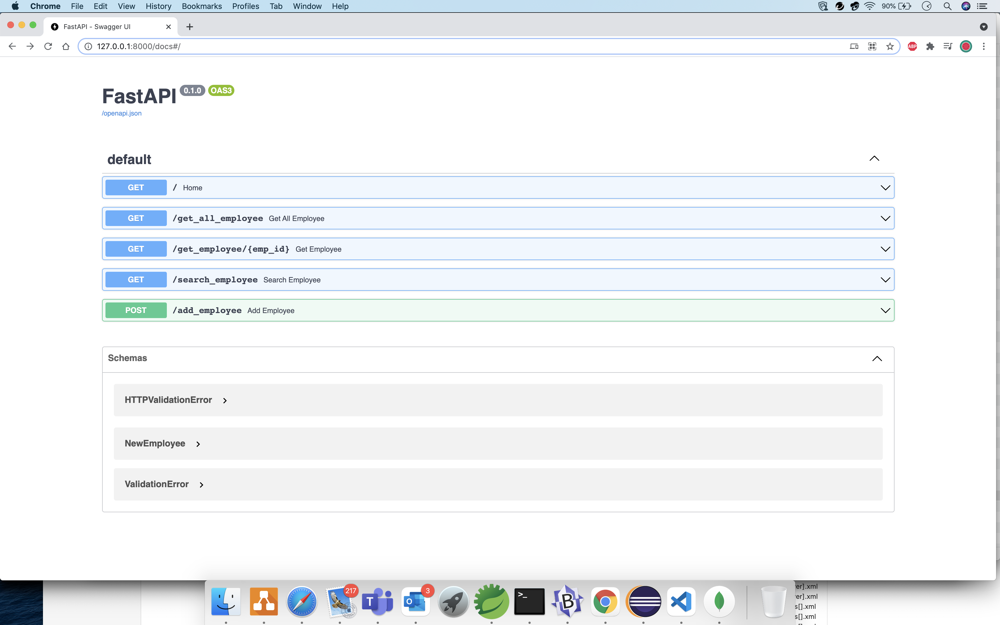

# FastAPI_simple-app
A simple App using FastAPI

### How to setup

pip3 install -r requirements.txt

virtualenv venv
source venv/bin/activate

### Run Server
uvicorn main:app --reload

http://127.0.0.1:8000/docs

http://127.0.0.1:8000/redoc

